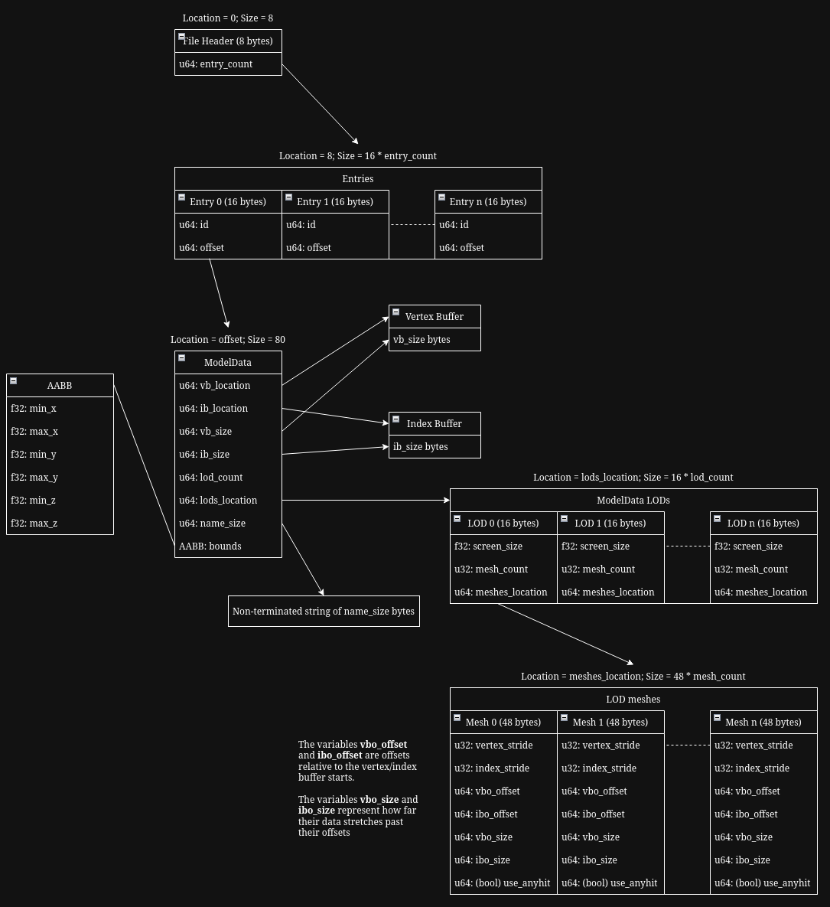

# Paper Asset Packager
This is a small program that takes many glTF files and packages them into one large custom (.prb) file. This file is specifially designed to work with Paper Renderer as a bit of an abstraction of all the model data within a 
"scene", and nothing else.

## Creating a File
Building the paper_asset_packager project (rust). Paper renderer binary (.prb) files can be created by supplying input .glb files in the proper specified format **TODO**. When running the program, check the output to make
sure no errors occured. If no errors occured, the output will be put in the /output folder, and is ready for use.

## Extracting File Data
Extracting file data in C++ is super easy and can be done with the get_model_data() function in prb_import.hpp. For more information on what this function does, refer to the return type, which is an almost 1:1 representation
of what you would use in Paper Renderer.

## File Layout Diagram
A diagram explaining the file layout is shown here

